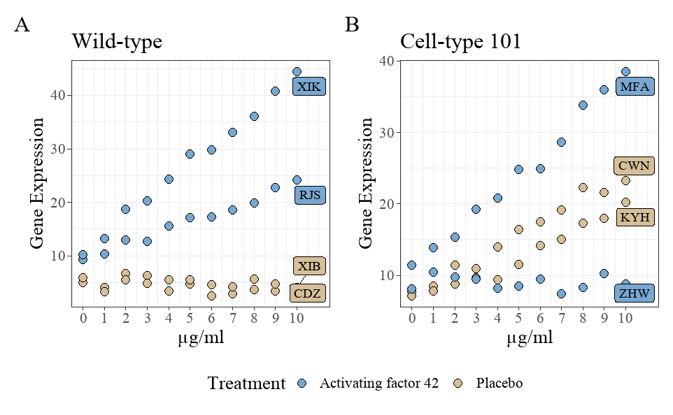

About README:

This README.md can be viewed on GitHub. Additionally, this repository contains both `README-code.qmd` and `README-code.html` files. `README-code.qmd` is the source code used for editing the README and can be opened and edited in RStudio. `README-code.html` is an HTML format report file compiled from the source code and can be opened in RStudio as well as any web browser.

# 1. Project information

## 1.1 Introduction to this project

This project is a collaboration with Dr. Karl Berator. The project aims to investigate the impact of a new treatment, activating factor 42, on the promotion of gene expression by growth factors.

## 1.2 Project contacts

For further collaboration on the project, please contact Dr. Karl Berator at karl.berator\@gmail.com.

If you have any questions regarding the current analysis, please contact me (Yingxin Xu) at: Mobile: 0468862372; Email: a1871793\@adelaide.edu.au

## 1.3 Project software

The language used for the project is R-4.4.0, and the analysis software is RStudio. If you need to install R language and RStudio, please follow the instructions on [this website](https://posit.co/download/rstudio-desktop/) to download and install the version suitable for your device.

## 1.4 How to download the project to your device

This repository contains all the relevant files for the R project "Karl-Project". Once you have installed R and RStudio, you only need to download this project to your local device, unzip it, and then open it in RStudio.

## 1.5 Introduction to project folder and files

### (1). `R-code`：

This is a folder containing all the R code for the work previously done for Karl. All files are in Rmd (RMarkdown) format and can be directly executed in RStudio. The files are named following the format "year-month-day-code content.Rmd".

### (2). `raw-data`:

The folder contains the original data sent by Karl, which has not been altered and is labelled with the date of data reception.

### (3). `data`:

The folder is used to store the modified data during the analysis process. Since the previous research did not involve storing the modified data, the folder currently only contains the original data.

### (4). `figs`:

The folder contains figures generated during the analysis that may be needed for further use.

### (5). `tabs`:

The folder contains tables generated during the analysis that may be needed for further use.

### (6). `slides`:

The folder contains a presentation on Exploratory Data Analysis (EDA) provided to Karl.

### (7). `font`:

This folder contains the a font file required for plotting.

### (8). `report`:

The folder stores the reports generated during the analysis.

# 2. Current analysis

## 2.1 Introduction to data set

The data set `2024-03-04-WIF-tis4d.xlsx` is stored in the folder `raw-data`. It contains following terms:

1.  `cell_line`: The two cell line types used for the experiment, Wild-type and Cell-type 101, character.

2.  `Treatment`: This variable describes whether to add new treatment. Added: Activating factor 42; Not added: Placebo (saline added instead), character.

3.  `name`: Names of different cell lines. There are two cell lines for each identical cell line type and the same treatment. There were 8 cell lines in total, character.

4.  `conc`: Different concentration of a growth factor, from $0$ to $10$, numeric.

5.  `gene_expression`: Gene expression level, numeric.

## 2.2 EDA (2024-3-21)

Karl requested an EDA on this data set and a presentation be prepared to explain the results to his boss. The complete code for performing EDA on the data is located in the `R-code` folder, named `2024-03-21-EDA.Rmd`. The slides are located in the `slide` folder, named `2024-03-21-EDA.pptx`.

## 2.3 Reproducing an EDA figure (2024-04-01)

Karl requested to plot the following figure and save as an .tiff file (9in x 6in) with a resolution of 500, and use Time New Roman font.

This is a gene expression vs. growth factor concentrations plot. The plot is divided into two parts based on cell line type, labelled as A and B, and different colors are used to represent different treatments. The tags on the graph represent different cell line individuals.

The complete code for this is located in the `R-code` folder, named `2024-04-01-Figure.Rmd`. The figure was saved in the `figs` folder, named `gene_fig.tiff`.

## 2.4 Calculate sample size for grant (2024-05-22)

Karl requested to calculate sample size for a grant application. They were going to do a linear regression of gene expression with five predictors: concentration, cell age, treatment (two levels), cell type (two levels), and media (two levels). They have done a previous study and got an $R^2$ of 0.1 between the predictors and the response level. They wanted a power of $90\%$ and a significance level of $0.05$.

The calculation shows that they need a total of $154$ samples.

The complete code for this sample size calculation is located in the `R-code` folder, named `2024-05-22-sample size.Rmd`. For better understanding, we have also generated a report named `2024-05-22-sample-size.pdf`, located in the `report` folder.

## 2.5 Fit predictive models (2024-05-28)

The final step of the current analysis is to fit a predictive model to the gene expression data.

As mentioned earlier, the purpose of this project is to explore the impact of different treatments on the promotion effect of growth factors on gene expression. Among the five variables, gene expression is the response variable, while the other four are independent variables, consisting of three categorical variables and one numerical variable.

From the previous EDA, differences in gene expression across various levels of cell line type and treatment were observed. Generally, gene expression tends to increase with higher concentrations of growth factors. As depicted in the gene figure shown below, even with identical treatment and growth factor concentrations, disparities in gene expression persist among different individuals of the same cell line type. Consequently, it can be considered to include the variable `name` as either an independent variable or a random effect (since in future predictions, we might encounter new cell line individuals, so fitting parameters only for the current eight cell line individuals would be unreasonable).

Therefore, two models were considered: a linear model and a linear mixed-effects model. In the linear model, `name` is treated as a regular categorical variable. In the mixed-effects model, `name` is treated as a random effect. Additionally, since the study aims to investigate the effect of treatment on the relationship between growth factor and gene expression, we also tested the necessity of adding the interaction term between `Treatment` and `conc` in both the linear model and the linear mixed-effects model. The results indicate that adding this interaction term is crucial for both models. So the following two models were compared:

1.  Linear model:

    gene_expression \~ Treatment \* conc + cell_line + name

2.  Linear mixed-effects model (1\|name indicates that `name` is a random factor):

    gene_expression \~ Treatment \* conc + cell_line + (1\|name)

Subsequently, the two models were compared using AIC, BIC, and regression diagnostic plots. The comparison results indicated that the linear model slightly outperformed the linear mixed-effects model. However, the difference between the two models was very small. Considering that new cell line individuals will be encountered in future predictions using the model, `name` should still be treated as a random effect. Therefore, the final model chosen is a linear mixed-effects model with `gene_expression` as the response variable, `Treatment`, `conc`, and `cell_line` as fixed effects, `name` as a random effect, and an interaction term between `Treatment` and `conc`.

The complete model fitting process code can be found in the `R-code` folder in the `2024-05-28-Fit models.Rmd` file. For a more detailed model analysis process, please refer to the `2024-05-29-IMRaD-Report.pdf` file in the `report` folder.

## 2.6 IMRaD report (2024-05-29)

Finally, Karl requested an IMRaD report that encompasses all the key points from the analysis process described above. This report serves as a summary of the previous work but does not include all the code. The R code to generate this IMRaD report can be found in the `R-code` folder, named `2024-05-29-IMRaD-Report.Rmd`. The corresponding PDF report is in the `report` folder, named `2024-05-29-IMRaD-Report.pdf`.
